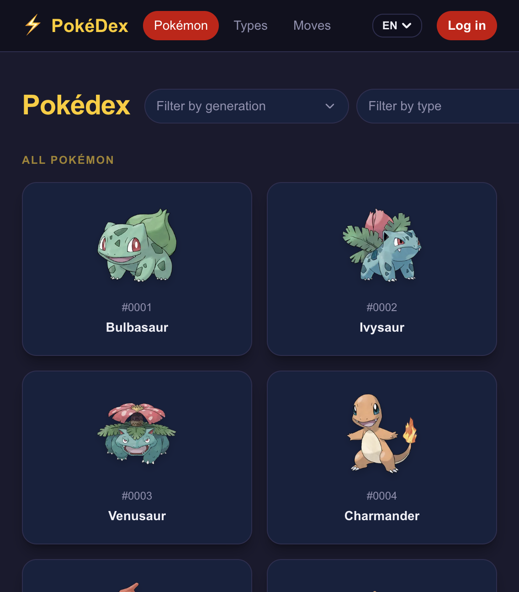
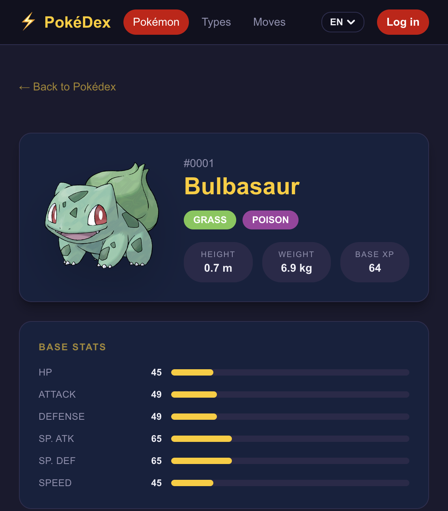
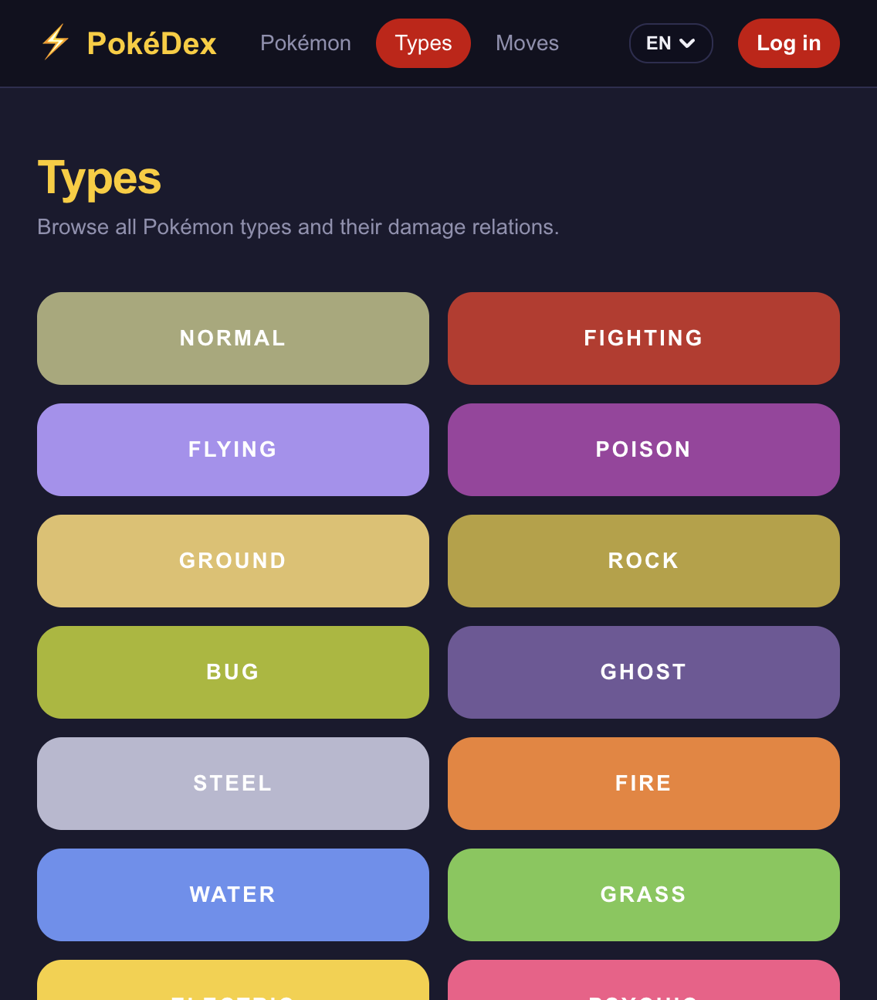
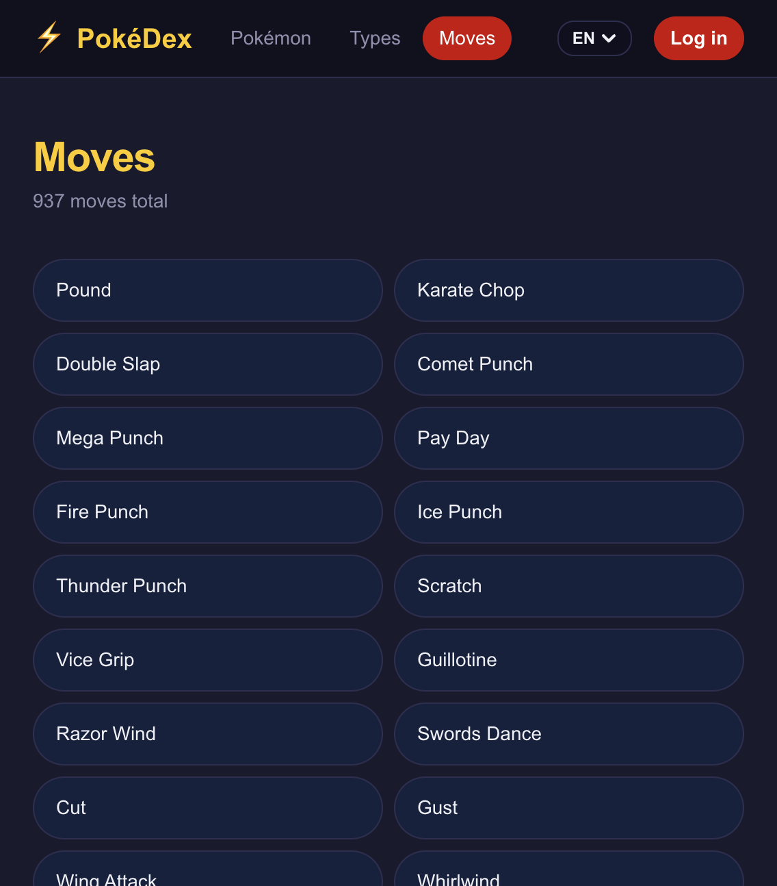
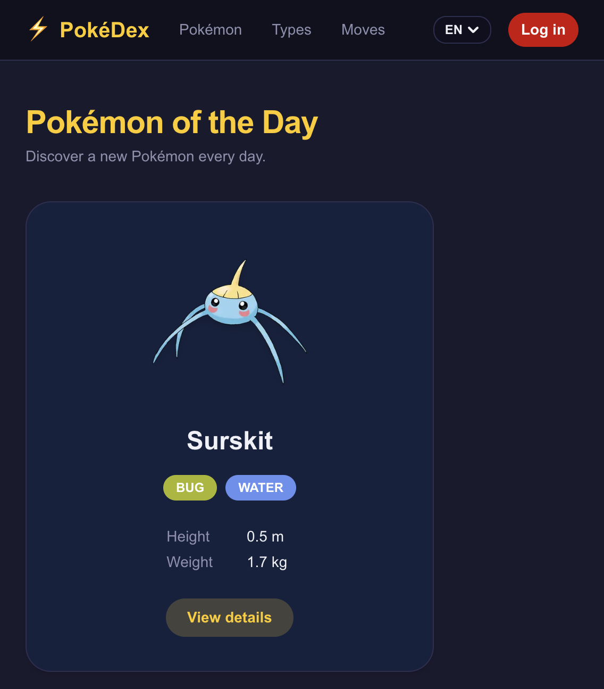
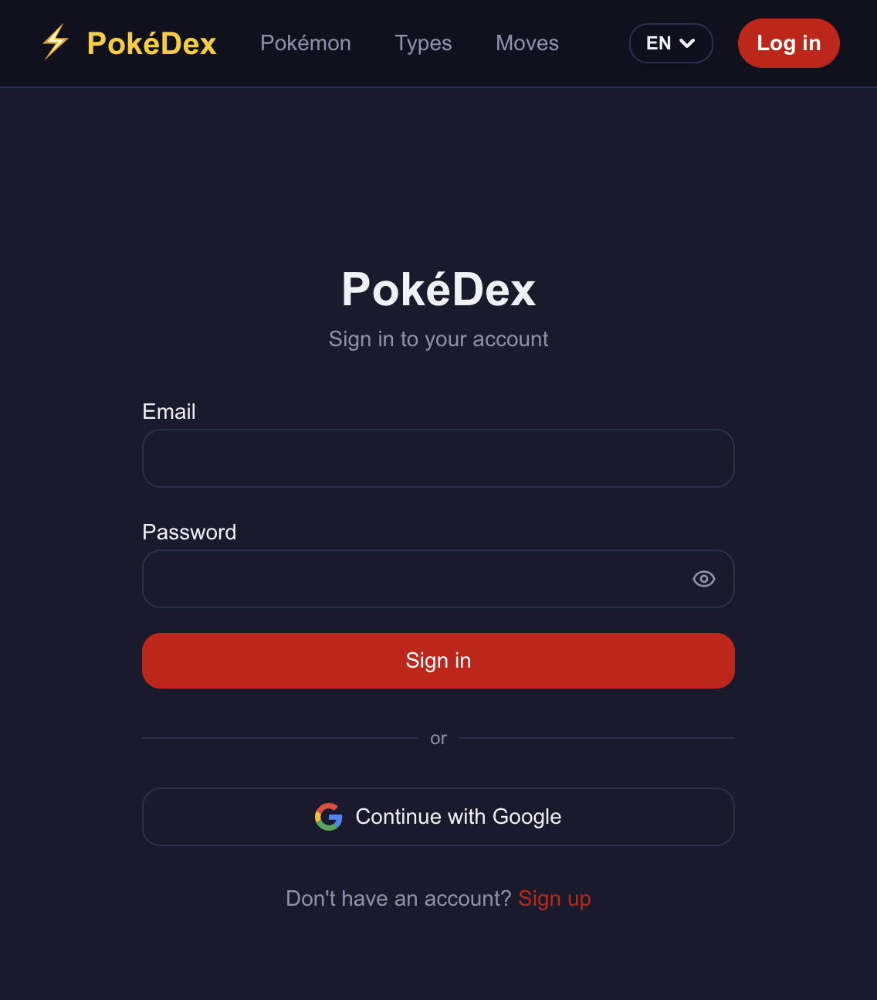

# PokéDex Web

A modern Pokémon encyclopedia built with Next.js, React, and Firebase. Browse Pokémon, types, moves, and items — save favorites, switch languages, and discover a new Pokémon every day.

**Live app:** [https://pokedex-web-sooty.vercel.app/](https://pokedex-web-sooty.vercel.app/)



---

## Features

- **Pokédex** — paginated list of 1,000+ Pokémon with type and generation filters
- **Pokémon details** — artwork, stats, abilities, and moves with localized names
- **Types** — color-coded grid with damage relations and associated moves
- **Moves & Items** — searchable, paginated lists with detail modals
- **Pokémon of the Day** — one shared Pokémon per UTC day, revealed on click
- **Favorites** — save Pokémon locally as a guest, or sync to the cloud when signed in
- **Authentication** — email/password and Google sign-in via Firebase
- **Internationalization** — English, Spanish, and German (UI + PokeAPI entity names)

---

## Tech Stack

| Category | Tools |
|----------|-------|
| Framework | Next.js 16 (App Router), React 19, TypeScript |
| Styling | Tailwind CSS 4, Radix UI, Lucide icons |
| Data | [PokeAPI](https://pokeapi.co/), TanStack React Query |
| Auth & Storage | Firebase Auth, Firestore |
| Client state | Zustand |
| Forms | React Hook Form, Zod |
| Testing | Jest, React Testing Library, Cypress, Storybook |
| Deployment | [Vercel](https://vercel.com) |

---

## Project Structure

```
pokedex-web/
├── app/[lang]/              # Locale-prefixed routes (en, es, de)
│   ├── pokemon/             # Pokédex list, filters, detail pages
│   ├── types/               # Type grid and type detail
│   ├── moves/               # Move list with modals
│   ├── items/               # Item list with modals
│   ├── pokemon-of-the-day/  # Daily Pokémon feature
│   ├── favorites/           # Saved Pokémon (auth required)
│   ├── login/               # Sign in / sign up
│   └── profile/             # User profile
├── components/              # Shared UI (Nav, cards, pagination, modals)
├── hooks/                   # Favorites, pagination, localized names
├── lib/
│   ├── api/                 # PokeAPI fetchers
│   ├── services/            # Firebase favorites service
│   └── i18n.ts              # Translation dictionaries
├── store/                   # Zustand stores (auth, favorites)
├── providers/               # AuthProvider, QueryProvider
├── messages/                # en.json, es.json, de.json
├── cypress/e2e/             # End-to-end tests
└── stories/                 # Storybook component stories
```

Routes are organized by feature. Server Components fetch data and pass localized API entity names to Client Components; UI strings are resolved client-side via `useTranslation().t(key)`.

---

## Architecture

The application follows a split architecture: **server-side rendering** for data fetching and initial page delivery, and **client-side interactivity** for user actions after the page loads.

### Request lifecycle

When a user navigates to a route (e.g. `/en/pokemon`):

```
1. User requests the URL
        ↓
2. Next.js executes the Server Component for that route
        ↓
3. Server fetches data from PokeAPI
        ↓
4. Server returns pre-rendered HTML with data included
        ↓
5. Browser hydrates interactive Client Components (filters, pagination, forms)
        ↓
6. Subsequent user actions (e.g. filter changes) are handled client-side via React Query
```

### Technology responsibilities

| Tool | Layer | Responsibility |
|------|-------|----------------|
| **Server Components** | Server | Fetch and render Pokémon data before the response is sent. Improves initial load time and SEO. |
| **Client Components** | Browser | Handle user interactions: forms, filters, modals, and navigation state. |
| **PokeAPI** | External | REST API providing Pokémon, type, move, and item data. |
| **React Query** | Server + Browser | Manages API caching and deduplication. Prefetches on the server; reuses cache on the client when filters or pagination change. |
| **Zustand** | Browser | Manages client-side state: authentication status and guest favorites persisted in localStorage. |
| **Firebase** | Browser + Cloud | User authentication and cloud storage for signed-in user favorites via Firestore. |

### System overview

```
┌─────────────────────────────────────────────────────────┐
│  SERVER (Next.js)                                       │
│                                                         │
│  Route handler → PokeAPI fetch → HTML response          │
└─────────────────────────────────────────────────────────┘
                          ↓
┌─────────────────────────────────────────────────────────┐
│  CLIENT (Browser)                                       │
│                                                         │
│  Interactive UI (filters, forms, navigation)            │
│       ↓              ↓              ↓                   │
│  React Query    Zustand        Firebase SDK             │
│  (API cache)    (client state) (auth + favorites sync)  │
└─────────────────────────────────────────────────────────┘
                          ↓
┌─────────────────────────────────────────────────────────┐
│  EXTERNAL SERVICES                                      │
│                                                         │
│  PokeAPI (Pokémon data)    Firebase (auth + Firestore)   │
└─────────────────────────────────────────────────────────┘
```

### Server vs Client Components

**Server Components** (default in the App Router)
- Execute on the server at request time
- Suitable for data fetching and reading `params.lang` for PokeAPI localization
- Example: `app/[lang]/pokemon/page.tsx`

**Client Components** (files with `"use client"`)
- Execute in the browser after hydration
- Required for interactivity and all UI translations via `useTranslation().t(key)`
- Examples: `PokemonList`, `LoginForm`, `Nav`

Client Components are used only where interactivity is required; data fetching remains on the server wherever possible.

---

## Screenshots

### Pokémon detail



### Types



### Moves



### Pokémon of the Day



### Login



---

## Getting Started

### Prerequisites

- Node.js 20+
- pnpm
- Firebase project (for auth and favorites)

### Install and run

```bash
pnpm install
pnpm dev
```

Open [http://localhost:3000](http://localhost:3000). The app redirects to `/en/pokemon` by default.

### Environment variables

Create a `.env.local` file:

```env
NEXT_PUBLIC_POKE_API_URL=https://pokeapi.co/api/v2
NEXT_PUBLIC_POKE_SPRITES_URL=https://raw.githubusercontent.com/PokeAPI/sprites/master/sprites

NEXT_PUBLIC_FIREBASE_API_KEY=your_api_key
NEXT_PUBLIC_FIREBASE_AUTH_DOMAIN=your_project.firebaseapp.com
NEXT_PUBLIC_FIREBASE_PROJECT_ID=your_project_id
NEXT_PUBLIC_FIREBASE_APP_ID=your_app_id
```

---

## Scripts

| Command | Description |
|---------|-------------|
| `pnpm dev` | Start development server |
| `pnpm build` | Production build |
| `pnpm start` | Run production server |
| `pnpm test` | Run Jest unit tests |
| `pnpm test:coverage` | Run tests with coverage |
| `pnpm cypress:open` | Open Cypress interactively |
| `pnpm cypress:run` | Run Cypress headless |
| `pnpm storybook` | Start Storybook on port 6006 |
| `pnpm lint` | Run ESLint |

---

## Testing

The project uses a layered testing setup:

**Unit & integration (Jest + React Testing Library)** — components, hooks, stores, API helpers, and services. Tests live in `__tests__/` folders next to the code they cover.

**End-to-end (Cypress)** — 10 spec files covering navigation, Pokémon list/detail, types, moves, items, favorites, login, and Pokémon of the Day. A custom `cy.visitAsUser()` command simulates authenticated sessions without hitting Firebase in CI.

**Storybook** — isolated development for shared UI components (`Button`, `CharacterCard`, `Pagination`, etc.).

Pre-commit hooks run Prettier, the full test suite, and ESLint on every commit.

---

## Deployment

The app is deployed on [Vercel](https://vercel.com). Each push triggers a production build. Environment variables are configured in the Vercel dashboard.

PokeAPI responses are cached server-side for one hour. Pokémon sprites are served through `next/image` with remote patterns configured for the PokeAPI sprite CDN.

---

## Data Sources

- **[PokeAPI](https://pokeapi.co/)** — all Pokémon, type, move, and item data
- **Firebase Auth** — user sign-in (email/password, Google)
- **Firestore** — persisted favorites for signed-in users (`users/{uid}/favorites/{id}`)

Guest favorites are stored in the browser via Zustand persist middleware. Signed-in users get real-time sync across devices through Firestore `onSnapshot` subscriptions.

---

## Internationalization

Supported locales: **English**, **Spanish**, **German**.

UI strings come from JSON dictionaries in `messages/`. PokeAPI entity names (Pokémon, types, abilities) are localized using the API's built-in `names[]` arrays. Locale is stored in a cookie and reflected in the URL (`/en/pokemon`, `/de/pokemon`, etc.).

---

## License

Private project.
